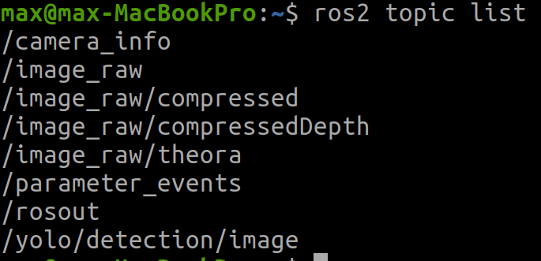
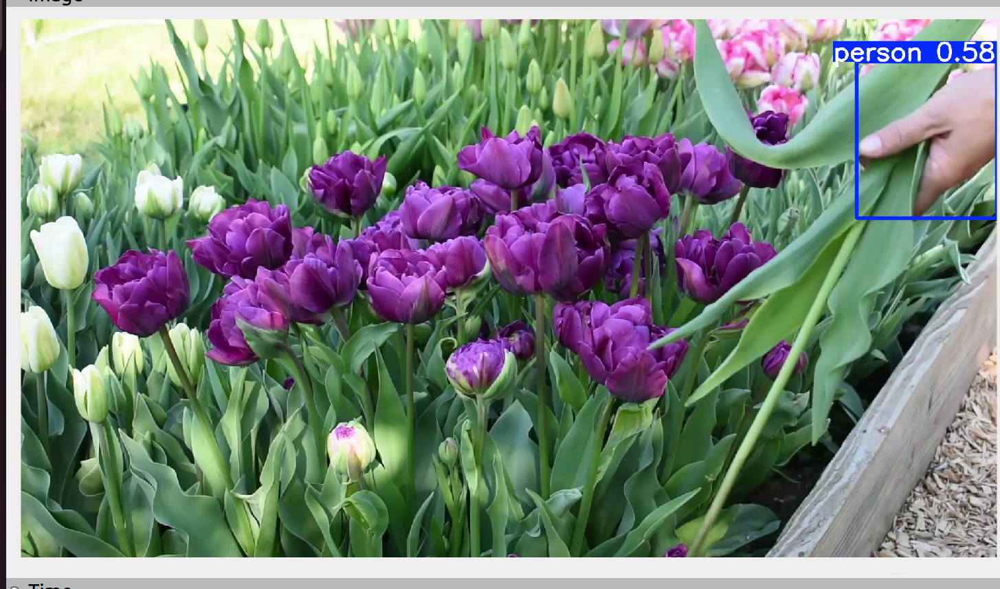
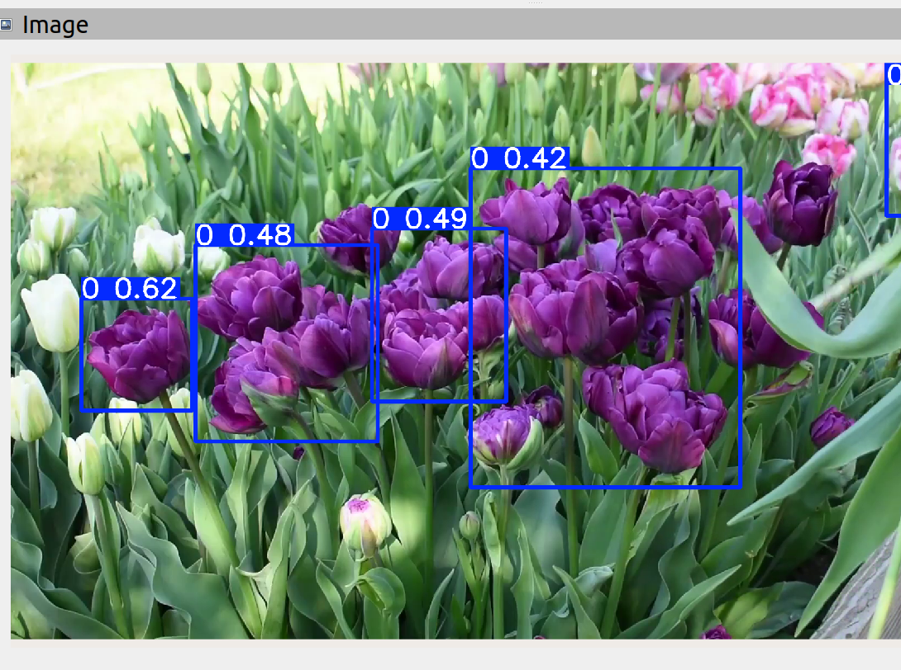

# README

## Requirements
Ubuntu 22.04.X + ROS2 Humble

## Code Setup

### Clone this repo into a ROS2 Workspace

### Install these dependencies

```pip install ultralytics```

```pip install ros2-numpy```


### Select the desired video file in src/yolo_pkg/launch/yolo_launch.py
Default is the provided test.mp4 (if you want to add your own video file, you also need to add that in setup.py)

### Then, source the environment and build the package using 

```source /opt/ros/humble/setup.bash```

```colcon build```

### And, finally, run the ROS Node with

```source install/setup.bash```

```ros2 launch yolo_pkg yolo_launch.py```

### If you want a visualisation

Run Rviz in a separate terminal, click add on the bottom left and select the yolo/detection/image topic to view the bounding boxes

----

### Task Approach

I firstly drew a pseudo rqt graph, to have a visualisation of the proposed task. After that I looked into the steps for creating a YOLO ROS2 node, which I mostly found in the Ultralytics YOLO documentation (this was for ROS1 though, so I had to convert some code to make it operational). Then I created a launch file that publishes an .mp4 file as a ROS node (I downloaded a YouTube video of Amsterdam and some flowers for this demo). The YOLO node then subscribes to the /image_raw topic and publishes the YOLO image detections.

### Results

Below are some results obtained the aforementioned approach.


<video src="Yolo_Rviz_street_demo.webm" controls="controls" style="max-width: 100%;"></video>

### Bonus

Then, for the bonus I trained the YOLO26n model on a public flower dataset (https://universe.roboflow.com/yue-xing-dvchh/yolov8-flowers-detection/model/2) for 40 epochs to see if the YOLO26n model could detect flowers, as this is not part of its pretrained classes. 



After training, you can see in trained_yolo_flowers.png that it now does detect the flowers, so the training worked. At epoch 38 it reached its maximum mAP50 of 0.87 on the flower dataset, which is quite a good score. If you want to try this for yourself, you can change the detection model in yolo.py to yolo_flowers.pt and change the video input to flowers.mp4 with the method described previously.

